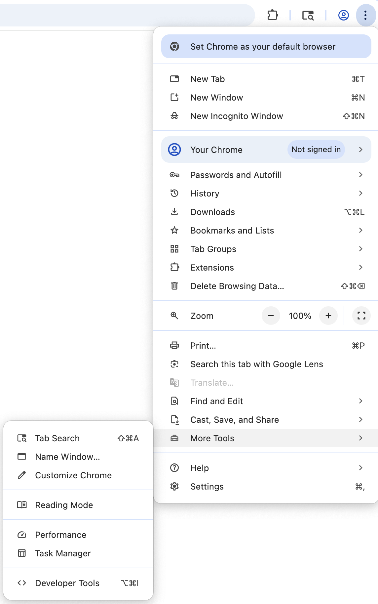

# ScripT-Rex
An easy-to-use DevTool utility for re-initializing the Chrome Dinosaur game by bypassing loadTimeData restrictions.
## Instructions
1. Go to chrome://dino in the Chrome browser
2. Open devtools
   * Press ctrl+shift+i

     OR

<figure>
  
  <figcaption>Go to the 3 dots drop-down menu</figcaption>
</figure>
<figure>
  
  <figcaption>Go to "More Options" and select "Developer Tools"</figcaption>
</figure>
