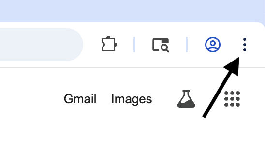

# ScripT-Rex
An easy-to-use DevTool utility for re-initializing the Chrome Dinosaur game by bypassing loadTimeData restrictions.
## Instructions
1. Go to chrome://dino in the Chrome browser
2. Open devtools
   * Press ctrl+shift+i
     OR

     
